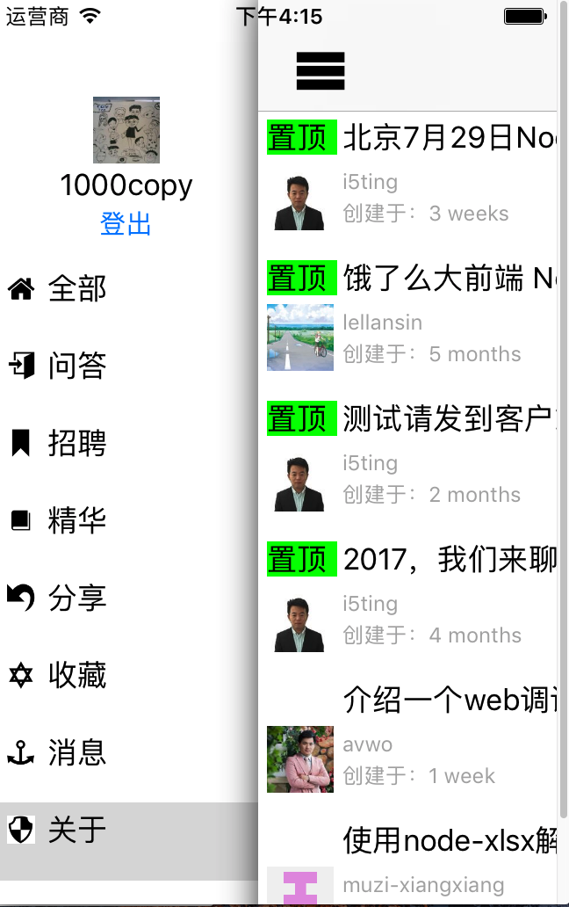

## cnodejs-swift 发布

全部使用 Swift 3.0 开发，IDE版本为8.2.1

### 截图

### 鸣谢

	Alamofire
    ObjectMapper 
    AlamofireObjectMapper
    Cartography
    Kingfisher 
    GTMRefresh
    DrawerController
    SwiftIcons
    PKHUD

### 安装

over-the-air in github.io

项目主页

https://github.com/1000copy/cnode

### 问题反馈

https://github.com/1000copy/cnode/issues

### 特别说明

我在学习swift，想要做一个cnode.js的客户端。我看到

	https://github.com/klesh/cnodejs-swift

想要拿现成的，但是这个仓库不支持swift3.0，并且我发布了issue也没有人理睬，干脆自己做算了
